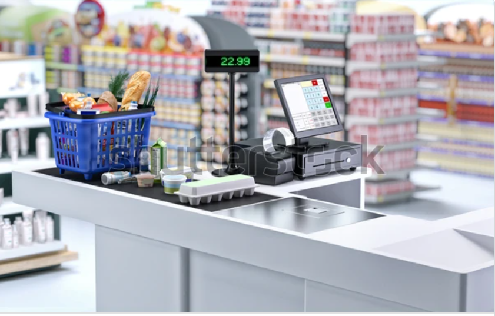
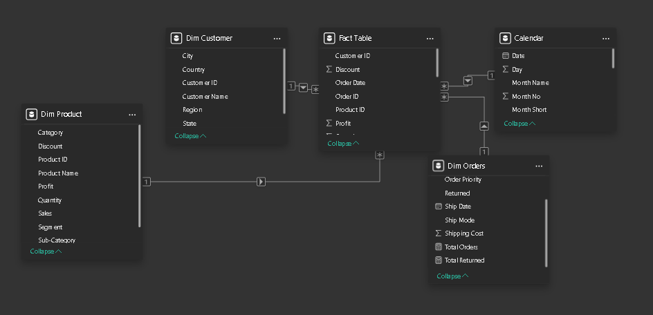
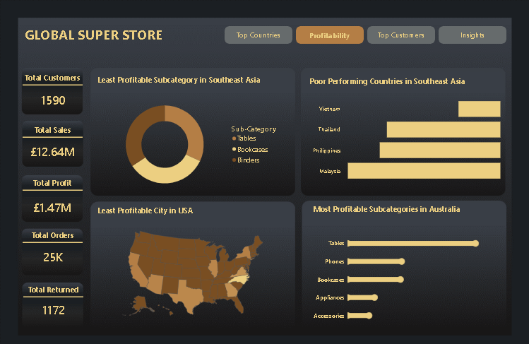
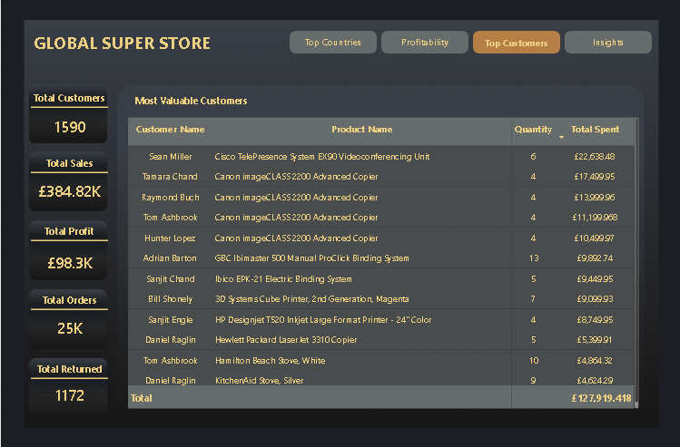

# Global Superstore Analysis

---

## Introduction
Global Superstore is a global online retailer based in New York, boasting a broad product catalogue and aiming to be a one-stop-shop for its customers. Global The superstore’s clientele, hailing from 147 different countries, can browse through an endless offering with more than 10,000 products. This large selection comprises three main categories: office supplies (e.g., staples), furniture (e.g., chairs), and technology (e.g., smartphones).

**_Disclaimer_**: _All datasets and reports do not represent any company or super market, but just a practice dataset to demonstrate capabilities of power BI._

Power Bi Concept Applied:

● Power Query 

● Data Modelling 

● Data Cleaning 

● Data Visualization

● Page Navigation

## Problem Statement
The aim of this project is to:
1.	Identity the three countries that generated the highest total profit for Global Superstore in 2014?
   
    •	For each of these three countries, find the three products with the highest total profit. Specifically, what are the products’ names and the total profit for each product?

2.	Identify the 3 subcategories with the highest average shipping cost in the United States.

3.	Assess Nigeria’s profitability (i.e., total profit) for 2014. How does it compare to other African countries?

4.	Identify the product subcategory that is the least profitable in Southeast Asia. Note: For this question, assume that Southeast Asia comprises Cambodia, Indonesia, Malaysia, Myanmar (Burma), the Philippines, Singapore, Thailand, and Vietnam.
   
    •	 Is there a specific country in Southeast Asia where Global Superstore should stop offering the subcategory identified above?

5.	Which city is the least profitable (in terms of average profit) in the United States? For this analysis, discard the cities with less than 10 Orders. b) Why is this city’s average profit so low?

6.	Which product subcategory has the highest average profit in Australia?

7.	Who are the most valuable customers and what do they purchase?

## Data Sourcing
The dataset was provided by @Digitaley Drive, an EdTech platform committed to empowering learners with in-demand tech skills through immersive and high-quality learning experiences.

The data, in CSV format, was imported into Power BI for cleaning, analysis, and visualization. It comprises three main tables:

- Orders: 51,290 records and 24 attributes

- People: 13 records and 2 attributes

- Returns: 1,172 records and 24 attributes

For improved analysis and data modeling, the tables were structured into Fact and Dimension tables, aligning with a star schema design.

## Data Transformation and Cleaning
The dataset was efficiently cleaned and transformed using Power Query in Power BI. Key data preparation steps included:

- Merging the Returns table with the Orders table

- Segmenting the data into a Fact Table and multiple Dimension Tables, including:

    o	Dim Customer

    o	Dim Orders
  
    o	Dim Product
  
- Removing duplicate entries from the dimension tables

- Changing the data types of the Sales, Profit, and Shipping Cost columns from Whole Number to Fixed Decimal to appropriately reflect currency values

- Creating and integrating a Calendar Table to support time-based analysis

## Data Modelling
Power BI automatically established relationships between the tables, resulting in a star schema model. 

A Fact Table was created, supported by three Dimension Tables—Order, Customer, and Product. 

All dimension tables, along with a Calendar Table, were connected to the fact table. While the relationships for the dimension tables were created automatically, the connection between the calendar table and the fact table was established manually using the Order Date column as the linking key.

## Data Visualization and Analysis
The Power BI report is organized into three pages:
1.	Top Countries
2.	Profitability
3.	Top Customers

### Top Countries

- The store serves 1,590 customers, with a total of 25,000 orders.
  
  o	Total Sales Revenue: £12.64 million
  
  o	Total Profit: £1.47 million
  
  o	Returned Orders: 1,172
- The United States emerged as the most profitable country, followed by India and Australia.
  
  o	In the U.S., top-performing brands include Canon, Ibico, and Fellowes.
  
  o	In Australia, Canon and Sauder lead in sales.
  
  o	In India, Apple, Sauder, and Nokia are among the best sellers.
  
- Tables, Machines, and Copiers incur the highest average shipping costs. Reducing logistics expenses in these categories could significantly improve overall profit margins.
- The report spotlights Africa's profitability in 2014, with Nigeria recording a loss of £5,041, making it the least profitable country on the continent.
  o	This loss is attributed to excessive shipping costs and the frequent use of discounts that were not balanced by an increase in sales volume, leading to reduced profitability.

### Profitability
  

- Tables, Bookcases, and Binders appear to be underperforming product categories, possibly due to low demand or high costs in certain regions.
- Malaysia ranked as the least profitable country overall, followed by the Philippines, Thailand, and Vietnam. This may be due to economic conditions, weak brand presence, or suboptimal pricing strategies.
- Within the U.S., Texas recorded the highest loss, amounting to $141.96, indicating poor performance. The map visualization further reveals other regions with similarly low profitability levels.
- Tables, Phones, Bookcases, Appliances, and Accessories drive profits.
- Tables and Phones are the highest-grossing subcategories.

### Top Customers

- Sean Miller spent £22,683.48 on Cisco TelePresence System DX80 Videoconferencing Unit (6 units). This highlights a strong demand for high-end business tech.

- High Demand for Canon image CLASS 2200 Advanced Copiers. Tamara C. Chand, Raymond Buch, Tom Ashbrock, Hunter Lopez each purchased 4 units, totalling £60K+. This suggests a strong demand for professional-grade printing solutions.

## Conclusion
-	The store has a moderate profit margin (25.5%), which is decent but could be optimized.
-	A 4.69% return rate suggests some product issues or customer dissatisfaction.
-	Consider bulk discounts for repeat customers.
-	Expand marketing efforts to corporate offices & businesses needing printing solutions.

## Recommendation
-	Improve profitability in Southeast Asia by reassessing demand for underperforming subcategories (Tables, Bookcases, and Binders).
-	Investigate Malaysia’s struggles—this market needs special attention.
-	Target low-performing U.S. cities with strategic pricing and localized marketing.
-	Capitalize on Australia’s high-profit categories (Tables & Phones) by replicating successful sales strategies in other regions.
-	Monitor return rates—reduce defective or low-quality items to improve margins.

